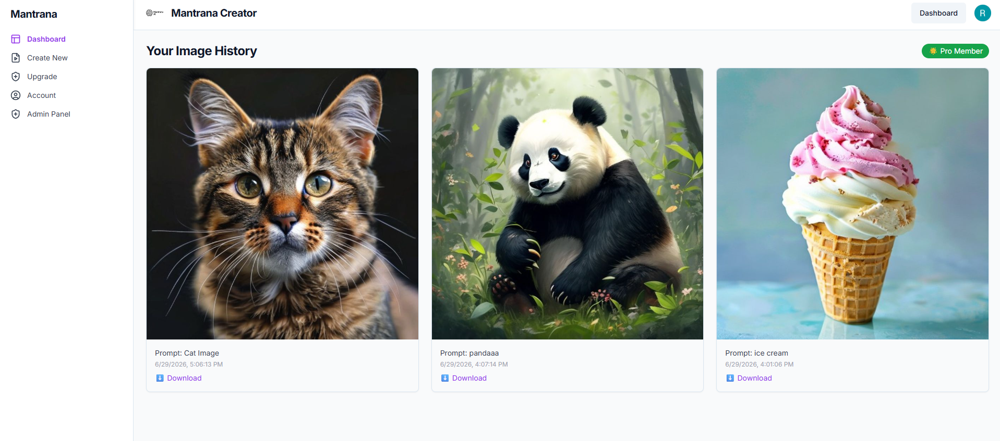
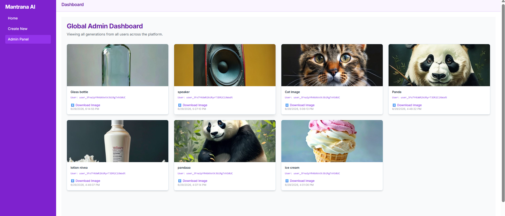

# Mantrana AI – AI Image Generator App


Welcome to **Mantrana AI**, a state-of-the-art AI image and video generation application. This platform leverages cutting-edge LLMs and image generation models to turn textual prompts into photorealistic images in seconds.

---

## 📖 Table of Contents
- [Problem Statement](#-problem-statement)
- [Solution Overview](#-solution-overview)
- [Key Features](#-key-features)
- [Tech Stack](#-tech-stack)
- [System Architecture](#-system-architecture)
- [High-Level Workflow](#-high-level-workflow)
- [Folder Structure](#-folder-structure)
- [Installation Guide](#-installation-guide)
- [Database Setup](#-database-setup)
- [Authentication Flow](#-authentication-flow)
- [API Overview](#-api-overview)
- [Database Schema](#-database-schema)
- [Screenshots & Demo](#-screenshots--demo)
- [Deployment Guide](#-deployment-guide)
- [Security Features](#-security-features)
- [Performance & Error Handling](#-performance--error-handling)
- [Project Roadmap & Future Enhancements](#-project-roadmap)
- [FAQ & Troubleshooting](#-faq--troubleshooting)
- [Contributing Guidelines](#-contributing-guidelines)
- [License & Author](#-license)

---

## 🎯 Problem Statement
In the rapidly evolving digital landscape, content creators, marketers, and designers often struggle to find or create high-quality, custom visual assets quickly. Traditional graphic design is time-consuming, while stock photos are often generic and overused. There is a need for an accessible, fast, and high-quality tool that can generate bespoke images directly from simple text descriptions.

## 💡 Solution Overview
**Mantrana AI** solves this problem by providing an intuitive, web-based platform where users can type a description and instantly receive a photorealistic image generated by advanced AI models (like FLUX). The application includes a freemium model, allowing users to test the platform with free credits before seamlessly upgrading to a Pro tier for unlimited access.

## 🎥 Project Demo

Watch the complete walkthrough of the project below.

https://github.com/Rithika-Techie/Mantrana-AI-Image-Generator-App/raw/master/public/demo.mp4

> If the video doesn't autoplay, click it to open in full screen.

## ✨ Key Features
- **High-Quality Image Generation**: Leveraging advanced FLUX models for photorealistic quality via Pollinations.ai.
- **Credit Quota System**: Secure, backend-enforced quota and credit management for free and Pro users.
- **Secure Image History**: Fully integrated with Supabase for persistent and secure image history storage.
- **Authentication**: Seamless and secure user onboarding and authentication powered by Clerk.
- **Payment Processing**: Integrated Stripe checkout for Pro tier upgrades.
- **Content Moderation**: Built-in backend filters to block illicit or harmful prompts before generation.
- **Responsive Dashboard**: Beautiful, mobile-friendly UI built with Tailwind CSS and Shadcn UI.
- **Image Downloading**: One-click high-resolution image downloads.

---

## 🛠 Tech Stack

**Frontend:**
- [Next.js 14](https://nextjs.org/) (App Router)
- [React](https://reactjs.org/)
- [TypeScript](https://www.typescriptlang.org/)
- [Tailwind CSS](https://tailwindcss.com/)
- [Shadcn UI](https://ui.shadcn.com/)
- [Lucide Icons](https://lucide.dev/)

**Backend & APIs:**
- [Next.js Route Handlers](https://nextjs.org/docs/app/building-your-application/routing/route-handlers)
- [Pollinations AI](https://pollinations.ai/) (Image Generation API)

**Database & Auth & Payments:**
- [Supabase](https://supabase.com/) (PostgreSQL Database)
- [Clerk](https://clerk.com/) (Authentication)
- [Stripe](https://stripe.com/) (Payments & Subscriptions)

---

## 🏗 System Architecture

The application is built on a modern Serverless architecture using Next.js.
1. **Client (Browser)**: Renders the React UI. Communicates securely with Next.js API routes.
2. **Next.js Backend (Vercel/Node)**: Handles API requests, enforces credit limits, validates prompts, and communicates with third-party APIs.
3. **Clerk**: Handles OAuth and JWT session management.
4. **Supabase (PostgreSQL)**: Stores user credits, subscription status, and generated image history.
5. **Stripe**: Manages webhook events for successful payments to update the database via the backend.
6. **AI Generator Engine**: Processes the text prompt and returns a generated image URL.

### 🔄 High-Level Workflow
1. User logs in via **Clerk**.
2. User navigates to `/dashboard/create-new` and submits a text prompt.
3. The frontend calls `POST /api/generate`.
4. The backend verifies the user's session and checks `user_credits` in **Supabase**.
5. If the user has credits or is a Pro user, the prompt is sanitized and sent to the **AI Model**.
6. The AI Model returns the image URL.
7. The backend securely decrements the user's credits and logs the image in `image_history`.
8. The frontend displays the image and updates the UI instantly.

---

## 📂 Folder Structure

```text
MantranaAI-main/
├── app/                        # Next.js App Router root
│   ├── (auth)/                 # Clerk authentication routes (sign-in, sign-up)
│   ├── account/                # User account management page
│   ├── api/                    # Backend API Route Handlers
│   │   ├── admin/history/      # Fetches global history for admins
│   │   ├── download/           # Proxy route to download generated images
│   │   ├── generate/           # Core image generation & credit deduction logic
│   │   ├── stripe/             # Stripe checkout and webhook handlers
│   │   └── user/               # User-specific routes (credits, personal history)
│   ├── dashboard/              # Protected dashboard area
│   │   ├── _components/        # Dashboard specific UI components (Sidebar, Header)
│   │   ├── admin/              # Admin dashboard view
│   │   ├── create-new/         # The main image generation interface
│   │   └── page.tsx            # Dashboard home
│   ├── upgrade/                # Stripe pricing and upgrade page
│   ├── globals.css             # Global Tailwind and base styles
│   ├── layout.tsx              # Root HTML/Body layout and ClerkProvider wrapper
│   └── page.tsx                # Public landing page
├── components/                 
│   └── ui/                     # Shadcn UI reusable components (Buttons, Inputs, etc.)
├── hooks/                      # Custom React hooks (e.g., use-toast)
├── lib/                        # Utility functions and shared libraries
│   ├── supabase.ts             # Supabase client initialization
│   └── utils.ts                # Tailwind merge and styling utilities
├── public/                     # Static assets (images, videos, SVGs)
│   └── demo.mp4                # Application demo video
├── middleware.ts               # Next.js edge middleware for Clerk route protection
├── next.config.js              # Next.js configuration
├── tailwind.config.ts          # Tailwind CSS configuration
└── tsconfig.json               # TypeScript configuration
```

---

## 🚀 Installation Guide

### Prerequisites
- Node.js (v18 or higher)
- npm or yarn
- A Supabase account
- A Clerk account
- A Stripe account

### 1. Clone the repository
```bash
git clone https://github.com/Rithika-Techie/Mantrana-AI-Image-Generator-App.git
cd Mantrana-AI-Image-Generator-App
```

### 2. Install dependencies
```bash
npm install
```

### 3. Environment Variables
Create a `.env.local` file in the root directory based on `.env.example`:

```env
# Clerk Authentication
NEXT_PUBLIC_CLERK_PUBLISHABLE_KEY=pk_test_...
CLERK_SECRET_KEY=sk_test_...
NEXT_PUBLIC_CLERK_SIGN_IN_URL=/sign-in
NEXT_PUBLIC_CLERK_SIGN_UP_URL=/sign-up

# Supabase Database
NEXT_PUBLIC_SUPABASE_URL=https://your-project.supabase.co
NEXT_PUBLIC_SUPABASE_ANON_KEY=eyJhbG...
SUPABASE_SERVICE_ROLE_KEY=eyJhbG...

# Stripe Payments
NEXT_PUBLIC_STRIPE_PUBLISHABLE_KEY=pk_test_...
STRIPE_SECRET_KEY=sk_test_...
```

### 4. Running the Application
Start the Next.js development server:
```bash
npm run dev
```
Navigate to `http://localhost:3000` to view the application.

---

## 🗄 Database Setup (Supabase)

You will need to create two primary tables in your Supabase project:

1. **`user_credits`**
   - `id` (uuid, primary key)
   - `user_id` (text, unique, maps to Clerk ID)
   - `generations_left` (integer, default: 5)
   - `is_pro` (boolean, default: false)
   - `created_at` (timestamp)

2. **`image_history`**
   - `id` (uuid, primary key)
   - `user_id` (text, references Clerk ID)
   - `prompt` (text)
   - `url` (text)
   - `timestamp` (timestamp)

*Note: Ensure Row Level Security (RLS) is configured appropriately if queried from the frontend, though most operations are securely handled via the backend service role.*

---

## 🔐 Authentication Flow
Mantrana AI uses **Clerk** for authentication.
1. The `middleware.ts` file protects all `/dashboard`, `/api/generate`, and `/api/user` routes.
2. Unauthenticated users attempting to access protected routes are redirected to `/sign-in`.
3. The Clerk `user.id` is extracted securely on the backend APIs to fetch database records, preventing horizontal privilege escalation.

---

## 🌐 API Overview

- **`POST /api/generate`**: Accepts a `prompt`. Validates content against illicit patterns. Checks user credits. Calls AI generation API. Decrements credits and saves history. Returns the image URL.
- **`GET /api/user/credits`**: Fetches the current `generations_left` and `is_pro` status for the authenticated user.
- **`GET /api/user/history`**: Fetches the chronological history of images generated by the authenticated user.
- **`POST /api/stripe/checkout`**: Initiates a Stripe checkout session for upgrading to the Pro tier.
- **`GET /api/download`**: Proxies the image URL to allow users to securely download the generated image directly to their device.

---

*Note: Any new screenshots added to the project should be placed in `docs/images/` and referenced here to keep the documentation organized and maintainable.*

### 1. Sign-in Page


### 2. User Dashboard


### 3. Global Admin History


---

## 🚢 Deployment Guide

The easiest way to deploy this application is via **Vercel**:
1. Push your code to a GitHub repository.
2. Go to [Vercel](https://vercel.com/) and import the repository.
3. Add all your environment variables from `.env.local` into the Vercel project settings.
4. Click **Deploy**.

For the Stripe webhook to work in production, ensure you add your production Vercel URL to your Stripe Webhook settings and update any Webhook Secret environment variables.

---

## 🛡 Security & Performance

### Security Features
- **Prompt Sanitization**: A robust Regex-based blocklist intercepts illicit, violent, or NSFW prompts before they are sent to the AI.
- **Backend Enforced Quotas**: Credit decrements happen exclusively on the server side using the Supabase Service Role key, making it impossible for malicious clients to bypass limits.
- **Route Protection**: Next.js Middleware ensures API endpoints and dashboard pages cannot be accessed without a valid Clerk JWT.

### Performance Optimizations
- **Edge Routing**: API routes utilize Next.js dynamic routing for fast response times.
- **Optimistic UI Updates**: The dashboard UI disables buttons and provides instant loading feedback while waiting for the AI model to respond.
- **React Hydration**: Fully leverages React Server Components (where applicable) and Client components seamlessly to reduce bundle size.

---

## 🛠 Troubleshooting & FAQ

**Q: I get a 403 Forbidden error when trying to generate an image.**
*A: Check your remaining credits. If you have 0 credits, you must upgrade to Pro. If you have credits, ensure your prompt does not violate the content moderation blocklist.*

**Q: Images are not saving to history.**
*A: Verify your `SUPABASE_SERVICE_ROLE_KEY` is correct in `.env.local`. The backend requires this key to bypass RLS and insert records securely.*

**Q: The Stripe checkout page won't load.**
*A: Ensure `NEXT_PUBLIC_STRIPE_PUBLISHABLE_KEY` and `STRIPE_SECRET_KEY` are valid and the product/price IDs in your checkout route match your Stripe Dashboard.*

---

## 🗺 Project Roadmap & Future Enhancements
- [ ] Implement Image-to-Image generation capabilities.
- [ ] Add advanced model settings (aspect ratio, styling tags).
- [ ] Implement a community gallery for users to share generated images.
- [ ] Add support for webhook-based asynchronous image generation for slower, ultra-high-res models.

---

## 🤝 Contributing Guidelines
We welcome contributions! Please follow these steps:
1. Fork the repository.
2. Create a new branch (`git checkout -b feature/AmazingFeature`).
3. Commit your changes (`git commit -m 'Add some AmazingFeature'`).
4. Push to the branch (`git push origin feature/AmazingFeature`).
5. Open a Pull Request.

---

## 📜 License
This project is licensed under the MIT License. See the [LICENSE](LICENSE) file for details.

## 👨‍💻 Author & Contact
Built with ❤️ for the AI community.
- **GitHub**: [Rithika-Techie](https://github.com/Rithika-Techie)
- **Project Link**: [Mantrana AI Image Generator](https://github.com/Rithika-Techie/Mantrana-AI-Image-Generator-App)
